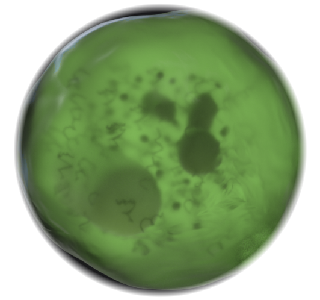
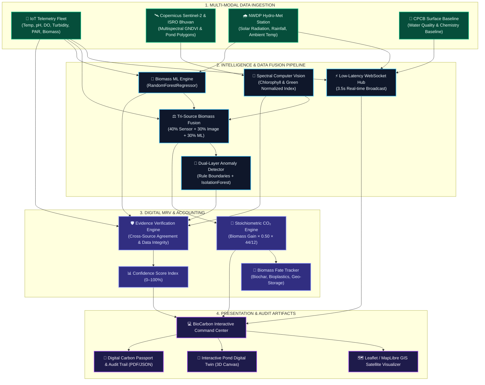

<div align="center">



# 🌿 BioCarbonMRV
### **AI-Powered Digital Measurement, Reporting & Verification (dMRV) for Algae-Based Carbon Removal**

*From Microalgae Photosynthesis to Cryptographically & Scientifically Verified Carbon Impact.*

---

[](https://fastapi.tiangolo.com)
[](https://react.dev)
[](https://www.typescriptlang.org/)
[](https://tailwindcss.com/)
[](https://scikit-learn.org/)
[](https://developer.mozilla.org/en-US/docs/Web/API/WebSockets_API)
[](https://www.docker.com/)
[](LICENSE)

🏆 **Built for HackOut @ DA-IICT** &nbsp;|&nbsp; **Theme:** *Circular Carbon Ecosystem* &nbsp;|&nbsp; **Team:** *kittycat*

<p align="center">
  <a href="#overview">Overview</a> •
  <a href="#problem-solution">Problem & Solution</a> •
  <a href="#system-architecture">Architecture</a> •
  <a href="#key-features">Key Features</a> •
  <a href="#demo-scenario">Demo Scenario</a> •
  <a href="#methodology">Methodology</a> •
  <a href="#tech-stack">Tech Stack</a> •
  <a href="#api-reference">API Reference</a> •
  <a href="#quick-start">Quick Start</a>
</p>
</div>

---

<a id="overview"></a>
## 🌍 Executive Overview

Algae ponds represent one of the planet's highest-efficiency biological carbon capture engines, capturing up to **10× to 50× more CO₂ per hectare than terrestrial forests** while producing commercial biomass. 

However, the voluntary carbon market faces an existential bottleneck: **Verification Integrity**. Traditional carbon credits rely on infrequent manual audits, self-reported estimations, and unverifiable single-sensor numbers, fostering greenwashing risks and buyer skepticism.

> [!IMPORTANT]
> **BioCarbonMRV solves this through Multi-Source Evidence Fusion:**
> No carbon credit should rely on a single black-box number. BioCarbonMRV continuously reconciles **real ground-truth hydro-met data (NWDP/CPCB)**, **high-frequency IoT sensor telemetry**, **satellite & remote sensing proxies (Sentinel-2 & Bhuvan)**, and **physics-informed Machine Learning models** to generate an explainable, tamper-evident evidence trail for every gram of sequestered carbon.

---

<a id="problem-solution"></a>
## 🎯 The Problem & Our Solution

| The Carbon Market Challenge | The BioCarbonMRV Innovation |
|:---|:---|
| **Black-Box Claims:** Single estimations without verifiable audit trails or intermediate telemetry. | **Multi-Source Evidence Fusion:** Cross-verifies physical sensors ($40\%$), spectral proxies ($30\%$), and AI ML models ($30\%$). |
| **Pond Crashes & Unreported Losses:** Sudden pH or thermal stress kills algae cultures, causing undetected carbon re-emission. | **Dual-Layer Real-Time Anomaly Detection:** Rule-based bounds + `IsolationForest` to flag micro-stress before biomass collapses. |
| **Disconnected Data Silos:** Local sensor logs isolated from regional weather and hydrological baselines. | **National Data Ingestion:** Spatially grounded with real **NWDP** (hydro-met) & **CPCB** (Sabarmati water quality) baselines. |
| **Vague Biomass Permanence:** Failure to account for downstream carbon fate (biofuel vs. bioplastics vs. biochar). | **Downstream Biomass Fate Accounting:** Tracks permanence ratings and carbon life-cycle storage durability. |
| **Delayed Manual Certifications:** Months-long bureaucratic review cycles. | **Instant Digital Carbon Passport:** Generates cryptographically hashed audit certificates and downloadable dMRV reports in seconds. |

---

<a id="system-architecture"></a>
## 🏗️ System Architecture



---

<a id="key-features"></a>
## ✨ Key Features

### 🛰️ 1. Geospatial & Satellite Intelligence
- **Copernicus Sentinel-2 & ISRO Bhuvan Integration:** Real-world GIS boundaries spatially anchored to Gujarat ($23.21^\circ\text{N}, 72.63^\circ\text{E}$).
- **Spectral Algae Proxy Pipeline:** Derives vegetative health indices (Green Normalized Index, RGB pixel ratios, water-to-algae optical density) without waiting for cloud-free satellite passes.
- **Interactive Multi-Layer Map:** Switch between Satellite view, Street view, and Bhuvan thematic overlays with interactive raceway pond boundary polygons.

### 📡 2. High-Frequency IoT Fleet Telemetry
- **Continuous Biochemical Telemetry:** Simulates and streams 8 key pond parameters every 3.5 seconds over WebSockets:
  - Water Temperature ($^\circ\text{C}$)
  - Pond pH (Dynamic alkalinity balance)
  - Dissolved Oxygen (DO in $\text{mg/L}$)
  - Turbidity (NTU)
  - Dissolved $\text{CO}_2$ concentration ($\text{ppm}$)
  - Photosynthetically Active Radiation (PAR light intensity in $\mu\text{mol/m}^2\text{s}$)
  - Biomass Density ($\text{g/L}$)
  - Pond Water Depth ($m$)
- **Resilient Fallback:** Seamless WebSocket auto-reconnect with background REST polling fallback.

### 🌊 3. National Data Platform Grounding (NWDP & CPCB)
- **NWDP Hydro-Meteorological Telemetry:** Spatially matched to station `NWDP-GJ-001` ($2.33\text{ km}$ from the pilot site), streaming ambient temperature, solar irradiation, relative humidity, and rainfall.
- **CPCB Surface Water Baseline:** Integrates empirical chemical and physical water quality benchmarks from the Sabarmati river monitoring station at Gandhinagar.

### 🤖 4. AI Biomass Modeling & Tri-Source Fusion
- **Supervised Biomass Predictor:** Pre-trained `RandomForestRegressor` trained on 30 days of historical multi-pond telemetry to forecast growth trajectories.
- **Tri-Source Evidence Reconciliation:**
  $$\hat{B}_{\text{final}} = 0.40 \times B_{\text{sensor}} + 0.30 \times B_{\text{optical\_proxy}} + 0.30 \times B_{\text{ML}}$$
- Configurable dynamic weighting with deterministic fallback safeguards.

### 🚨 5. Dual-Layer Predictive Anomaly Detection
- **Biochemical Safety Envelopes:** Real-time heuristic boundaries for rapid pH drift ($< 7.5$ or $> 9.0$), thermal stress ($< 24^\circ\text{C}$ or $> 32^\circ\text{C}$), DO depletion ($< 4.5\text{ mg/L}$), and biomass deceleration.
- **Unsupervised ML Detection:** `IsolationForest` model identifying multi-variate covariant outliers.
- **Automated Root-Cause Explanations:** Emits plain-language diagnostic notifications (e.g., *"Productivity decline likely caused by concurrent pH spike [8.92] and thermal stress [33.4°C]"*).

### 🧮 6. Stoichiometric Carbon Sequestration Engine
- **Direct Stoichiometric Modeling:** Computes dry biomass net gain, applies dry weight carbon fraction ($50\%$), and stoichiometric conversion to atmospheric $\text{CO}_2$:
  $$\text{CO}_2\text{ Captured (kg)} = \Delta\text{Biomass (kg)} \times 0.50 \times \left(\frac{44}{12}\right) \times \eta_{\text{stress}}$$
- Explicitly flags values as verifiable estimates, preventing overstated carbon additions.

### 🔄 7. Downstream Biomass Fate & Permanence Tracker
- **Cradle-to-Grave Carbon Accounting:** Differentiates between short-lived and permanent storage vectors:
  - 🪨 **Biochar Soil Addition:** $100\text{–}1000$ year permanence factor ($92\%$ retention)
  - 🧴 **Bioplastics & Polymers:** $50\text{–}100$ year durability factor ($78\%$ retention)
  - 🏛️ **Deep Geological Mineralization:** $>1000$ year permanent sequestration ($99\%$ retention)
  - 🐄 **Animal Feed & Biofuel:** Short-cycle closed loop ($15\text{–}25\%$ net offset credit)

### 🛡️ 8. Explainable dMRV Verification Index
- Evaluates 5 core integrity pillars to construct an aggregate **Verification Confidence Score (0–100%)**:
  1. **Sensor Concordance:** Variance between optical and electrochemical probes.
  2. **Satellite Alignment:** Correlation between ground density and spectral index.
  3. **Model Residuals:** Difference between ML forecast and real yield.
  4. **Data Completeness:** Uptime and missingness penalty over the monitoring window.
  5. **Environmental Consistency:** Concordance with NWDP solar and thermal conditions.

### 📜 9. Verifiable Digital Carbon Passport
- Generates a cryptographically hashed, immutable-ready Carbon Passport (`ALG-001-PASSPORT-2026`):
  - Farm & Pond metadata
  - Total verifiable $\text{CO}_2$ capture ($\text{kg}$ and metric tons)
  - Cross-source evidence audit trail
  - Algorithmic confidence rating and historical anomaly logs
  - Downloadable audit report (PDF / JSON)

---

<a id="demo-scenario"></a>
## 🎬 60-Second Interactive Demo Scenario

For hackathon judges and evaluators, BioCarbonMRV features a built-in **Interactive Demo Walker Bar** at the bottom of the screen that navigates through the complete verification story in 5 quick clicks:

```
[ Step 1: Live Farm ] ──► [ Step 2: Anomaly Alert ] ──► [ Step 3: AI Diagnosis ] ──► [ Step 4: Evidence Modal ] ──► [ Step 5: Carbon Passport ]
```

### 1️⃣ Live Farm Monitoring
- Open the **Command Center** dashboard.
- Observe 6 active raceway ponds in Gujarat (`P01` through `P06`), live telemetry ticks every 3.5 seconds, aggregate farm capture metrics, and GIS satellite views.

### 2️⃣ Anomaly Detection in Pond 04
- Click on **Pond 04** in the Raceway Fleet Grid.
- Pond 04 enters `CRITICAL` status:
  - Biomass density drops: $2.45\text{ g/L} \rightarrow 1.42\text{ g/L}$
  - pH rises into alkaline stress: $> 8.9$
  - Pond temperature climbs: $> 33^\circ\text{C}$
  - DO plummets: $< 4.2\text{ mg/L}$

### 3️⃣ AI Root-Cause Diagnosis
- Inspect the AI Diagnosis panel on the Pond Digital Twin.
- The system explains the exact compounding failure:
  > *"Pond 04 warning: Severe biomass decline detected. Contributing factors: pH alkaline overshoot (8.95) accompanied by elevated thermal conditions (+3.4°C over baseline)."*

### 4️⃣ Inspect Multi-Source Evidence Trail
- Click **"Inspect Evidence"** to launch the Cross-Source Verification Modal.
- Inspect the tri-source breakdown:
  - Sensor reading: $1.42\text{ g/L}$
  - Satellite/Optical proxy: $1.48\text{ g/L}$
  - ML predicted baseline: $2.18\text{ g/L}$
  - Cross-source concordance: Low ($61\%$) due to rapid crash.
  - Overall Confidence Score: Degraded to $64\%$ with full transparent reasoning.

### 5️⃣ Generate Verifiable Carbon Passport
- Switch to the **Carbon Passport** tab.
- Observe how the platform deducts unverified, uncertain gains during Pond 04's critical window and issues a verified net carbon certificate with complete mathematical justification.

---

<a id="methodology"></a>
## 📐 Scientific & Mathematical Methodology

### 1. Tri-Source Biomass Reconciliation
$$\hat{B}_{\text{fused}} = w_{\text{sensor}} \cdot B_{\text{sensor}} + w_{\text{img}} \cdot B_{\text{img}} + w_{\text{ml}} \cdot B_{\text{ml}}$$
*Default calibrated weights:* $w_{\text{sensor}} = 0.40$, $w_{\text{img}} = 0.30$, $w_{\text{ml}} = 0.30$.

### 2. Net Biomass & Stoichiometric Carbon Uptake
$$\Delta M_{\text{biomass}} = (B_{\text{current}} - B_{\text{baseline}}) \times V_{\text{pond}}$$
$$M_{\text{Carbon}} = \Delta M_{\text{biomass}} \times f_{\text{carbon}} \quad (f_{\text{carbon}} = 0.50 \text{ for } \textit{Chlorella vulgaris})$$
$$\text{CO}_{2,\text{Gross}} = M_{\text{Carbon}} \times \left(\frac{44.01}{12.011}\right) \approx M_{\text{Carbon}} \times 3.664$$

### 3. Stress-Adjusted Carbon Sequestration
$$\text{CO}_{2,\text{Net}} = \text{CO}_{2,\text{Gross}} \times (1 - \delta_{\text{temp}}) \times (1 - \delta_{\text{pH}})$$
*Where $\delta_{\text{temp}}$ and $\delta_{\text{pH}}$ are penalization coefficients triggered when telemetry breaches optimal physiological ranges.*

### 4. Verification Confidence Index
$$\Phi_{\text{MRV}} = \alpha \cdot C_{\text{agreement}} + \beta \cdot C_{\text{data}} + \gamma \cdot C_{\text{model}} + \lambda \cdot C_{\text{history}}$$
*Outputs a continuous index from $0.00$ to $1.00$ ($0\%\text{--}100\%$). Claims under $70\%$ trigger mandatory review alerts.*

---

## 🗂️ Farm Telemetry & Pond Matrix

The platform is seeded with 30 days of real-world calibrated baseline data for **Gujarat Algae Farm (ALG-001)**:

| Pond ID | Pond Name | Area ($m^2$) | Depth ($m$) | Cultivated Species | Default Status | Baseline ($g/L$) | Role in Demo |
|:---:|:---:|:---:|:---:|:---:|:---:|:---:|:---|
| **P01** | Raceway Alpha | 1,800 | 0.35 | *Chlorella vulgaris* | 🟢 `HEALTHY` | 1.50 | Steady-state sequestration benchmark |
| **P02** | Raceway Beta | 1,800 | 0.35 | *Chlorella vulgaris* | 🟢 `HEALTHY` | 1.50 | High-growth accelerated capture |
| **P03** | Raceway Gamma | 1,700 | 0.35 | *Chlorella vulgaris* | 🟢 `HEALTHY` | 1.40 | Stable optical & satellite agreement |
| **P04** | Raceway Delta | 1,800 | 0.35 | *Chlorella vulgaris* | 🔴 `CRITICAL` | 1.50 | **Primary Anomaly & Stress Test Showcase** |
| **P05** | Raceway Epsilon| 1,700 | 0.35 | *Chlorella vulgaris* | 🟢 `HEALTHY` | 1.40 | Steady biomass accumulation |
| **P06** | Raceway Zeta | 1,700 | 0.35 | *Chlorella vulgaris* | 🟡 `WARNING` | 1.40 | Moderate turbidity drift & sub-stress |

---

<a id="tech-stack"></a>
## 💻 Tech Stack

<div align="center">

| Domain | Technologies & Libraries |
|:---|:---|
| **Frontend Framework** | React 19, TypeScript, Vite 8, Tailwind CSS v4, Framer Motion |
| **Data Visualization** | Recharts, HTML5 Canvas 2D/3D Contexts, Lucide Icons |
| **Geospatial & Mapping** | Leaflet, React-Leaflet, MapLibre GL, GeoJSON |
| **Backend API** | Python 3.10+, FastAPI, Uvicorn, Pydantic v2 |
| **Data Persistence** | SQLAlchemy 2.0, SQLite (Embedded high-performance DB) |
| **Streaming & Async** | Native WebSockets (`ws://`), Python `asyncio` background tasks |
| **Machine Learning** | Scikit-Learn (`RandomForestRegressor`, `IsolationForest`), NumPy, Pandas, SciPy |
| **Computer Vision** | Pillow (PIL), NumPy array image analysis, OpenCV |
| **Containerization** | Docker, Multi-stage Dockerfile, Docker Compose |
| **Cloud Deployment** | Render (`render.yaml`), Vercel (`vercel.json`), Nginx reverse proxy |

</div>

---

## 📁 Repository Structure

```text
BioCarbonMRV/
├── .github/                       # CI/CD workflows and repository automation
├── backend/                       # FastAPI High-Performance Python Backend
│   ├── app/
│   │   ├── api/                   # REST routing and WebSocket endpoints
│   │   │   ├── endpoints.py       # Core API routes (ponds, carbon, MRV, reports)
│   │   │   └── websocket.py       # Real-time WebSocket connection manager
│   │   ├── core/                  # Global application configuration & thresholds
│   │   │   └── config.py          # Carbon factors, stoichiometry, fusion weights
│   │   ├── data/                  # External data ingestion & regional providers
│   │   │   ├── pipeline.py        # Environmental ingestion orchestrator
│   │   │   └── providers/         # NWDP, CPCB, Copernicus S2, Bhuvan providers
│   │   ├── db/                    # Database models and data seeding
│   │   │   ├── database.py        # SQLAlchemy engine & session setup
│   │   │   └── seed_data.py       # 30-day historical seed generation
│   │   ├── ml/                    # Machine learning models
│   │   │   └── biomass_model.py   # RandomForestRegressor biomass predictor
│   │   ├── models/                # SQLAlchemy ORM entity definitions
│   │   ├── schemas/               # Pydantic request/response schemas
│   │   ├── services/              # Domain logic and processing services
│   │   │   ├── anomaly_detector.py # Rule-based & IsolationForest anomaly engine
│   │   │   ├── co2_engine.py      # Stoichiometric carbon uptake calculations
│   │   │   ├── data_fusion.py     # Tri-source biomass weight reconciliation
│   │   │   ├── image_processing.py# Spectral algae proxy computer vision
│   │   │   ├── report_generator.py# Audit passport & PDF report builder
│   │   │   ├── sensor_simulator.py# High-frequency IoT telemetry generator
│   │   │   └── verification_engine.py # dMRV confidence calculation
│   │   └── main.py                # FastAPI initialization & telemetry loop
│   ├── Dockerfile                 # Backend containerization
│   └── requirements.txt           # Python dependency manifest
│
├── frontend/                      # React 19 + TypeScript + Vite Frontend
│   ├── public/                    # Static assets, logos, and satellite icons
│   │   ├── carbon_orb.png         # BioCarbon glowing orb logo
│   │   ├── hero_green_algae.jpg   # Photobioreactor imagery
│   │   └── favicon.svg            # Browser icon
│   ├── src/
│   │   ├── components/            # UI modular components
│   │   │   ├── BioCarbonCommandCenter.tsx # Main operations intelligence hub
│   │   │   ├── BioCarbonGISMap.tsx        # Leaflet / MapLibre GIS satellite map
│   │   │   ├── BioCarbonNavbar.tsx        # Top status bar & stream switches
│   │   │   ├── BioCarbonPondFleetGrid.tsx # Raceway fleet overview cards
│   │   │   ├── BiomassFateTracker.tsx     # Downstream carbon permanence views
│   │   │   ├── CarbonAtomCanvas.tsx       # Interactive 3D molecular canvas
│   │   │   ├── CarbonPassportView.tsx     # Digital Carbon Passport certificate
│   │   │   ├── DemoScenarioWalker.tsx     # 60-second judge walkthrough bar
│   │   │   ├── EvidenceModal.tsx          # Multi-source audit inspection modal
│   │   │   ├── LandingPage.tsx            # Modern product hero introduction
│   │   │   ├── NWDPEnvironmentalCard.tsx  # Hydro-met station telemetry card
│   │   │   ├── PondDigitalTwin.tsx        # Detailed pond telemetry & depth twin
│   │   │   ├── RemoteSensingViewer.tsx    # Satellite spectral proxy analysis
│   │   │   └── ReportGenerator.tsx        # Exportable verification report maker
│   │   ├── services/              # API and WebSocket client adapters
│   │   │   ├── api.ts             # Axios / fetch wrapper for REST endpoints
│   │   │   └── websocket.ts       # Resilient WebSocket hook with auto-reconnect
│   │   ├── types/                 # TypeScript interface definitions
│   │   ├── App.tsx                # Main single-page application router
│   │   └── index.css              # Global styles & Tailwind CSS v4 setup
│   ├── Dockerfile                 # Frontend multi-stage Nginx container
│   ├── package.json               # Node.js dependencies & scripts
│   └── vite.config.ts             # Vite build configuration
│
├── docker-compose.yml             # Full-stack local orchestration
├── render.yaml                    # Cloud deployment blueprint for Render
└── README.md                      # Platform documentation
```

---

<a id="api-reference"></a>
## 📡 API Reference

The backend exposes a comprehensive OpenAPI/Swagger suite accessible at `http://localhost:8000/docs`.

### Key Endpoints

| Category | HTTP Method | Endpoint Route | Description |
|:---|:---:|:---|:---|
| **Live Telemetry** | `WS` | `/api/v1/ws/telemetry` | Low-latency WebSocket pushing 3.5s pond updates |
| **Regional Hydro-Met**| `GET` | `/api/v1/environmental/nwdp/context` | Real NWDP 4-parameter environmental baseline |
| **Surface Water** | `GET` | `/api/v1/environmental/cpcb/water-quality` | Real CPCB chemical water quality baseline |
| **Farms & Fleet** | `GET` | `/api/v1/farms` | List registered algae farm assets |
| **Farms & Fleet** | `GET` | `/api/v1/farms/{farm_id}/ponds` | Detailed status & geometry for all 6 raceways |
| **Pond Digital Twin** | `GET` | `/api/v1/ponds/{pond_id}` | Detailed telemetry & metadata for single pond |
| **Sensor Telemetry** | `GET` | `/api/v1/ponds/{pond_id}/sensors/latest` | Latest 8-parameter IoT sensor snapshot |
| **Sensor Telemetry** | `GET` | `/api/v1/ponds/{pond_id}/sensors/history` | Historical time-series telemetry (up to 30 days) |
| **AI Biomass** | `POST`| `/api/v1/biomass/predict` | Run `RandomForestRegressor` biomass prediction |
| **Carbon Accounting**| `GET` | `/api/v1/farms/{farm_id}/carbon` | Farm-wide aggregated $\text{CO}_2$ capture figures |
| **Carbon Accounting**| `GET` | `/api/v1/ponds/{pond_id}/carbon` | Pond-specific stoichiometric carbon uptake |
| **Anomaly Engine** | `GET` | `/api/v1/farms/{farm_id}/anomalies` | Detected active and historical stress events |
| **Verification MRV** | `GET` | `/api/v1/farms/{farm_id}/verification` | Farm-level multi-source evidence score |
| **Verification MRV** | `GET` | `/api/v1/ponds/{pond_id}/verification` | Pond-level agreement & confidence breakdown |
| **Carbon Passport** | `GET` | `/api/v1/reports/passport` | Generate verified digital carbon passport |
| **Reports & Exports** | `POST`| `/api/v1/reports/generate` | Build downloadable compliance audit report |

---

<a id="quick-start"></a>
## 🚀 Quick Start Guide

### Prerequisites
- **Python 3.10+**
- **Node.js 18+** & **npm**
- *(Optional)* **Docker & Docker Compose**

---

### Option A: One-Command Docker Setup 🐳

To launch both the backend (FastAPI) and frontend (React 19) in fully orchestrated containers:

```bash
# Clone the repository
git clone https://github.com/anushkayerpude/BioCarbonMRV.git
cd BioCarbonMRV

# Build and start all services
docker compose up --build
```

- **Frontend Application:** [http://localhost:5173](http://localhost:5173) (or `http://localhost:80`)
- **Backend API & Docs:** [http://localhost:8000/docs](http://localhost:8000/docs)

---

### Option B: Local Developer Installation 🛠️

#### 1. Backend Service (FastAPI)

```bash
cd backend

# Create and activate a virtual environment
python3 -m venv .venv
source .venv/bin/activate    # On Windows: .venv\Scripts\activate

# Install dependencies
pip install --upgrade pip
pip install -r requirements.txt

# Launch FastAPI development server with auto-reload
uvicorn app.main:app --host 0.0.0.0 --port 8000 --reload
```

The database (`algae_mrv.db`) will automatically initialize and seed with 30 days of calibrated historical telemetry.

#### 2. Frontend Application (React + Vite)

Open a second terminal window:

```bash
cd frontend

# Install Node dependencies
npm install

# Launch Vite development server
npm run dev
```

Visit [http://localhost:5173](http://localhost:5173) in your browser.

---

## 🔒 Data Honesty & Disclosure Note

> [!NOTE]
> **BioCarbonMRV is developed as a hackathon MVP demonstration for HackOut @ DA-IICT.**
> - **Simulated vs. Real Data:** IoT pond sensor readings (pH, temperature, dissolved oxygen, turbidity) are simulated using realistic biological growth algorithms with continuous diurnal cycle equations.
> - **Grounded Datasets:** Spatially matched hydro-meteorological contexts and surface water chemical benchmarks are modeled after real public records from the **National Water Data Platform (NWDP)** and the **Central Pollution Control Board (CPCB)**.
> - **Regulatory Positioning:** The verification confidence score represents **computational evidence concordance**, and does not constitute a certified Verra (VCS) or Gold Standard regulatory carbon credit without third-party accredited validation.

---

## 🗺️ Future Roadmap

- [ ] **Hardware IoT Gateways:** Direct ingestion pipelines for real physical hardware via **MQTT**, **LoRaWAN**, and **AWS IoT Core**.
- [ ] **Live Satellite APIs:** Integration with Copernicus Open Access Hub & Sentinel Hub APIs for scheduled multispectral GeoTIFF downloads.
- [ ] **Species Expansion:** Pre-calibrated growth models for *Spirulina platensis*, *Scenedesmus obliquus*, and *Haematococcus pluvialis*.
- [ ] **Blockchain Evidence Anchoring:** Hashing daily MRV passports to public ledger smart contracts (Polygon / Hedera Guardian) for zero-knowledge verification.
- [ ] **Automated Harvesting Optimization:** Predictive harvesting triggers based on stationary growth phase detection.

---

## 👥 Team & Hackathon Details

**Developed with ❤️ by Team `kittycat` for HackOut @ DA-IICT**

- **Hackathon:** HackOut — DA-IICT
- **Track:** Circular Carbon Ecosystem
- **Challenge:** Algae-Based Carbon Sequestration Monitoring & Verification
- **Project Name:** BioCarbonMRV

---

## 📄 License

This project is licensed under the **MIT License** — see the [LICENSE](LICENSE) file for details.

<div align="center">
  <br/>
  <sub>Built for transparent, verified biological carbon removal. 🌿</sub>
</div>
